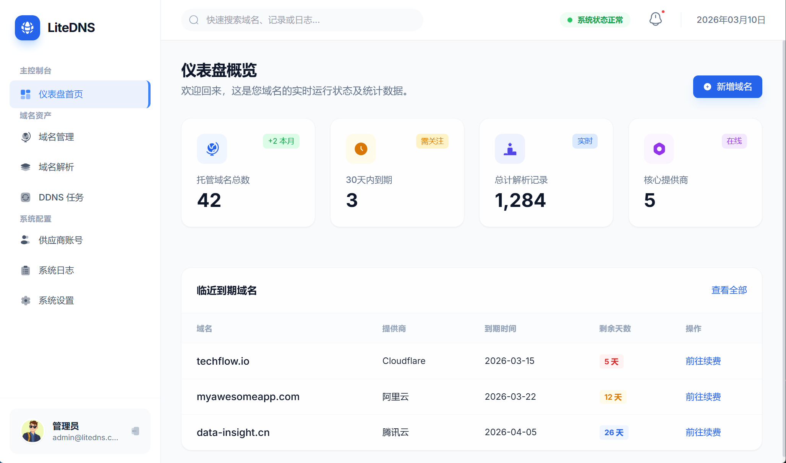
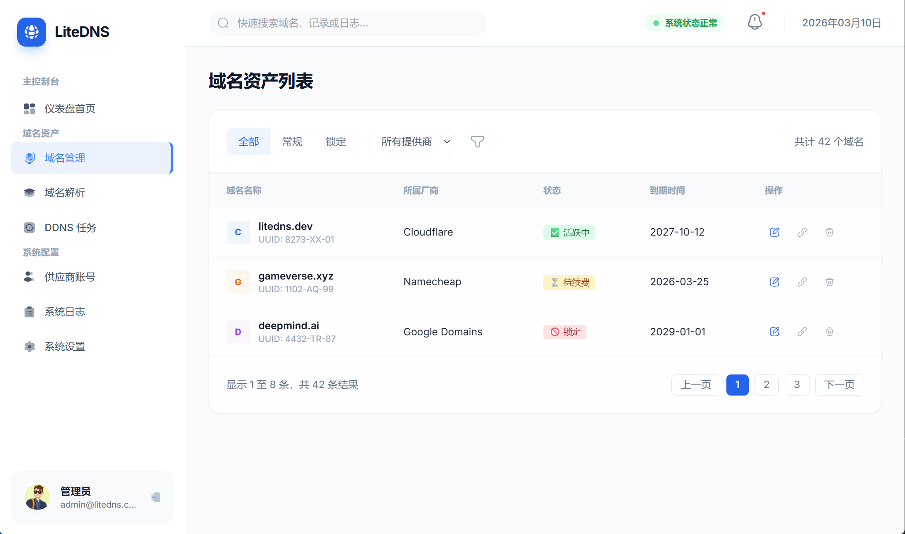
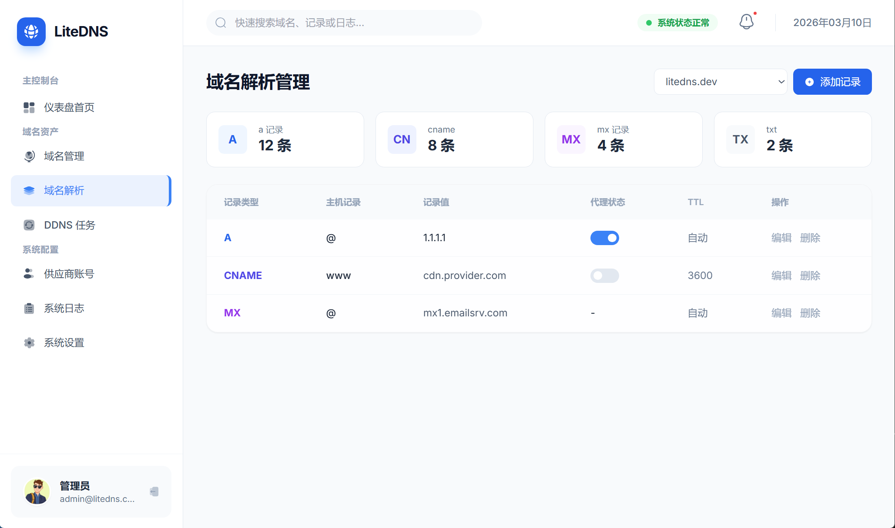
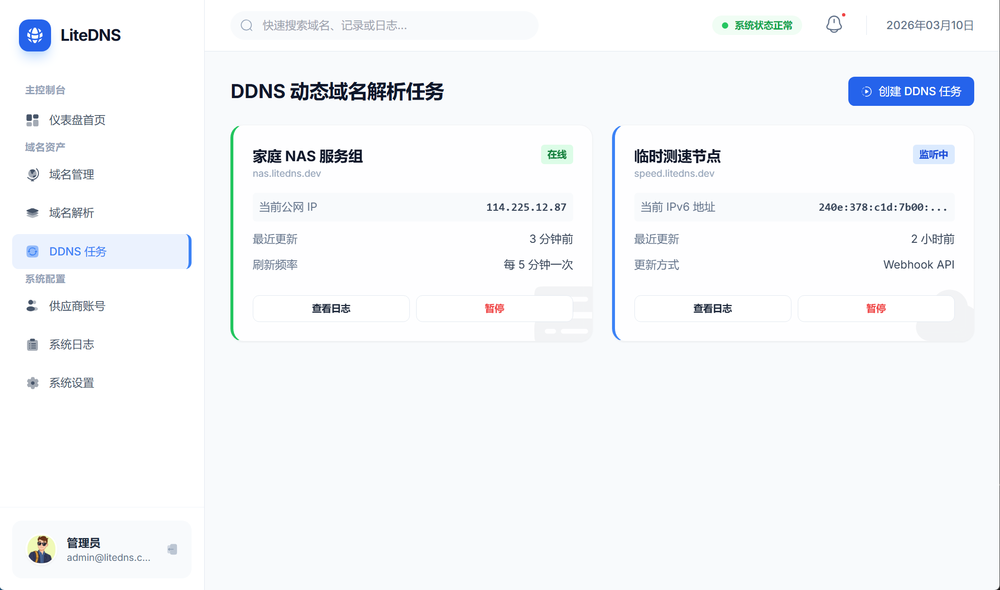
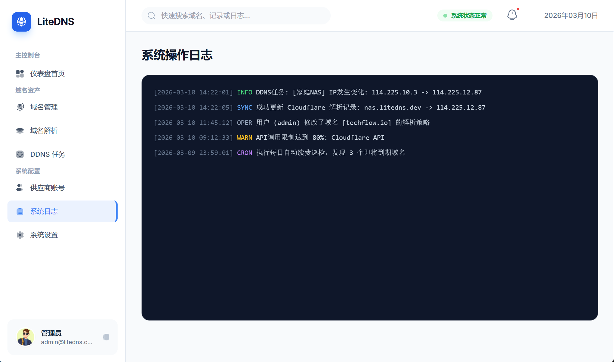
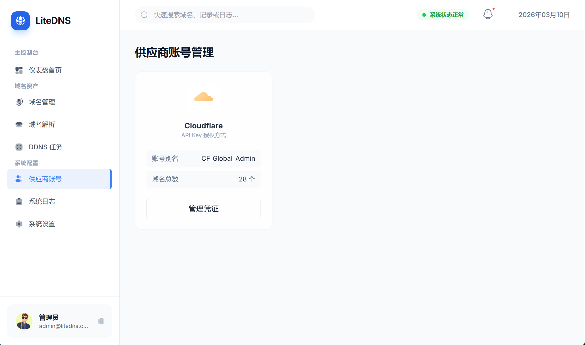

# LiteDNS

LiteDNS 是一个轻量、自托管的域名与 DNS 运维平台，聚焦于“多供应商账号统一管理 + 解析记录可视化维护 + DDNS 自动更新 + 日志审计”。

适合个人开发者、小团队和中小业务场景，用一套控制台管理分散在不同 DNS 服务商的域名资产。

## 核心能力

- 统一域名资产管理
  - 聚合展示域名、到期时间、状态与续费入口。
  - 支持按供应商筛选与分页浏览。
- DNS 解析记录管理
  - 支持常见记录类型（A/CNAME/MX/TXT 等）的查看、编辑与删除。
  - 解析记录与远端供应商可同步。
- DDNS 动态域名任务
  - 支持周期执行与手动触发。
  - 支持公网 IP 检测与自动更新解析记录。
- 供应商账号管理
  - 内置阿里云、Cloudflare 适配能力（可扩展）。
- 系统日志与审计
  - 记录 DDNS 执行、操作行为与异常信息，支持按条件查询。

## 典型使用场景

- 家庭 NAS / Homelab 的动态公网 IP 绑定。
- 统一管理多个项目域名的解析记录。
- 监控即将到期域名并快速跳转续费。
- 团队内对 DNS 变更进行留痕审计。

## 技术栈

- Backend: Go + Gin
- Frontend: Vue 3 + Vite + Tailwind CSS
- Database: SQLite
- Deploy: Docker / Docker Compose

## 目录结构

- `cmd/litedns`: 后端入口
- `internal`: 后端核心模块
- `frontend`: Web 控制台源码
- `configs`: 配置示例
- `scripts`: 本地开发与构建脚本
- `Dockerfile`: 容器镜像构建文件
- `docs`: 架构与设计文档

## 开发启动

- `./scripts/dev.sh`
  - 同时启动后端服务（Go）和前端开发服务（Vite）。
  - 默认读取 `configs/config.local.yaml`（若不存在会自动由 `configs/config.example.yaml` 生成）。
- `./scripts/dev.sh --master-key "<BASE64_32_BYTE_KEY>"`
  - 指定自定义 `LITEDNS_MASTER_KEY`，并同时启动前后端。
- 强制重置 admin 密码：
  - 在项目根目录创建 `configs/admin-password`，文件内容写入新密码后启动服务。
  - 启动时若文件密码与数据库不一致，会强制更新 admin 密码、吊销已有登录会话，并尝试删除该文件。
  - 密码文件为空或少于 8 个字符时启动失败。

## 构建

- `./scripts/build.sh`
  - 构建前端静态资源到 `frontend/dist`，并编译后端到 `bin/litedns`。
- `make build`
  - 等价于执行 `./scripts/build.sh`。

## Docker 部署

- `make docker-build`
  - 先执行完整构建，再打包前后端一体化镜像 `litedns:latest`。
- `docker run --rm -p 18080:8080 -e LITEDNS_MASTER_KEY="<BASE64_32_BYTE_KEY>" litedns:latest`
  - 运行一体化镜像。
- `make docker-up`
  - 使用 `docker-compose.yaml` 启动容器。
- `make docker-down`
  - 停止并清理 Compose 服务。
- Compose 部署变量：
  - `LITEDNS_IMAGE`：镜像名，默认 `litedns:latest`
  - `LITEDNS_CONFIG_DIR`：宿主机配置目录，默认 `./configs`；容器内读取 `/app/configs/config.yaml`
  - `LITEDNS_DATA_DIR`：宿主机数据目录，默认 `./data`
  - `LITEDNS_HTTP_PORT`：宿主机映射端口，默认 `18080`
  - `LITEDNS_SERVER_TRUSTED_PROXIES`：可选，逗号分隔的代理 CIDR/IP（例如 `172.18.0.0/16,127.0.0.1`）
  - `LITEDNS_MASTER_KEY`：必填，Base64 编码的 32 字节主密钥
- Docker 一次性重置 admin 密码：
  - 将宿主机密码文件放入配置目录并挂载到 `/app/configs/admin-password`，文件内容为新密码。
  - 重置成功后容器会尝试删除该文件；如果挂载为只读导致删除失败，服务仍会启动并在日志中提示。

## 界面参考图

以下路径已预留在仓库中：`docs/screenshots/`。可将截图按同名文件放入后直接在 README 展示。

### 1. 仪表盘首页

### 2. 域名资产列表

### 3. 域名解析管理

### 4. DDNS 任务

### 5. 系统操作日志

### 6. 供应商账号管理

